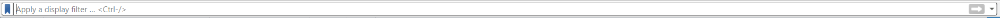

# Laporan-Analisis-jaringan

NAMA : M WALID FARHAN
NIM  : 09030282327039
MATKUL : Jaringan komputer

Selamat datang di github saya, pada blog ini saya hanya akan menuliskan dan menjelaskan laporan jaringan komputer apa saja yang telah saya pelajarin di kampus.
saya telah mempelajari bagaimana cara menggunakan wireshark dan menganalisis jaringan lalu lintas

# WIRESHARK 
Sebuah jaringan komputer dibangun dengan tujuan mengirimkan/menerima data antara satu end-point dengan end-point lainnya. Data dikirim dalam bentuk paket-paket. Struktur paket terdiri dari:

1. Header

Bagian header berisi alamat dan data lain yang diperlukan untuk mencapai tujuan yang dimaksudkan. Struktur dari header meliputi:
- Panjang paket
- Sinkronisasi
- nomor paket
- protokol
- alamat tujuan
- alamat user
  
2. display filter

pada aplikasi wiresahrk terdapat kolom pencarian yang bernama "filter"

yang dimana bisa digunakan untuk mempermudah mencari udp,tcp dll

Contoh filter tcp.port == 80 || udp.port == 80

- tcp.port == 80 menyaring semua paket yang menggunakan protokol TCP dan melewati port 80.

- Port 80 digunakan untuk HTTP (Hypertext Transfer Protocol), protokol yang digunakan untuk mengakses halaman web tanpa enkripsi (tidak aman dibandingkan HTTPS).
  
- Umumnya, paket dengan port ini akan terlihat dalam komunikasi antara browser dan server web.

Contoh bagaimana cara saya menentukan ip sumber ip tujuan?

Dari data yang dianalisis, alamat IP sumber yang sering terlihat adalah 192.168.55.71, yang kemungkinan merupakan alamat IP perangkat saya. Alamat IP tujuan yang sering muncul adalah 23.43.248.130, yang kemungkinan merupakan server yang diakses oleh perangkat.

